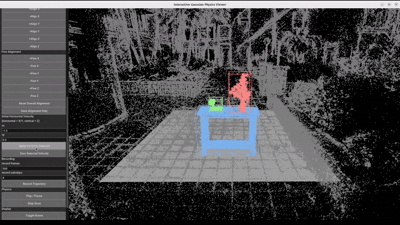
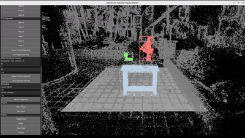

# 🧊 Interactive Multi-Object Feature Splatting with Physics Simulation

This project extends the **Feature Splatting** pipeline with:

- 🧩 Manual object segmentation (multi-view mask selection)
- 📦 Object-level Gaussian extraction
- 📐 Bounding box & coordinate alignment tools
- ⚙️ MPM-based physics simulation
- 🎮 Interactive viewer for motion editing and trajectory recording

---

## 🎮 Interactive Viewer (Usage)

Use the interactive viewer to:
- Move and rotate objects  
- Adjust global coordinate system  
- Assign initial velocities  
- Freeze selected objects  
- Control simulation in real time  

---

## ⚙️ Real-Time Simulation (Inside Viewer)

The viewer supports:
- Real-time rigid body simulation  
- Object-object interaction  
- Live motion preview  
- Trajectory recording  

---

## 🎥 Final Rendered Output

After simulation, results can be rendered using the original Feature Splatting renderer.

---

## ⚠️ Prerequisite

You must first install and run the original **Feature Splatting** project.

This repository only contains **additional tools built on top of it**.

After setup, place all files from this repo into the **root directory** of Feature Splatting.

---

## 📁 Files Included

- compute_obj_feature.py  
- manual_segment.py  
- segment_mul.py  
- bbox_mask_editor.py  
- mpm_phy_my.py  
- interactive_viewer.py  

---

# 🚀 Full Workflow

## Step 0 — Train Feature Splatting (original pipeline)

Run the original pipeline:

- compute features  
- train model  

After training, you will have:
output/<scene_name>

---

## 🧩 Step 1 — Object Segmentation

There are **two methods**:

---

### 🔹 Method 1: Manual Segmentation (Recommended)

Run:

python compute_obj_feature.py -m output/<scene_name>  
python manual_segment.py -m output/<scene_name>  

What happens:

- Generates mask previews  
- You manually select mask IDs in terminal  
- Multi-view voting determines final object Gaussians  

---

### 🔹 Method 2: Automatic Segmentation

Run:

python segment_mul.py -m output/<scene_name>  

Notes:

- Based on Feature Splatting pipeline  
- You must modify text prompts inside the file  
- Follow terminal instructions  

---

## 📐 Step 2 — Bounding Box & Coordinate Alignment

Run:

python bbox_mask_editor.py -m output/<scene_name>  

Purpose:

- Adjust object bounding boxes  
- Align coordinate system  
- Fix mismatch between reconstruction and simulation  

---

## ⚙️ Step 3 — Physics Simulation

There are **two ways to simulate motion**:

---

### 🔹 Option 1: Scripted Simulation

Run:

python mpm_phy_my.py -m output/<scene_name>  

---

### 🔹 Option 2: Interactive Viewer (Recommended)

Run:

python interactive_viewer.py -m output/<scene_name>  

Features:

- Move / rotate objects  
- Set initial velocity  
- Freeze objects  
- Real-time rigid body simulation  
- Record trajectories  

---

## 🎥 Step 4 — Rendering

After simulation, run:

python render.py -m output/<scene_name> -s <scene_path> --with_editing  

---

# 🧪 Example Pipeline

python compute_obj_feature.py -m output/my_scene  
python manual_segment.py -m output/my_scene  

python bbox_mask_editor.py -m output/my_scene  

python interactive_viewer.py -m output/my_scene  

python render.py -m output/my_scene -s feat_data/my_scene --with_editing  

---

# 💡 Tips

- Manual segmentation gives better results  
- Always align coordinate system before simulation  
- Use viewer to debug motion before rendering  

---

# 🚧 Limitations

- Interactive mode only supports rigid bodies  
- Simulation depends on coordinate alignment  
- Incorrect setup may break physics  

---

# 📌 Summary

This extension enables:

- Multi-object Gaussian control  
- Physics-based motion simulation  
- Real-time interactive editing  

for dynamic scene manipulation using Feature Splatting.

## Acknowledgement

This project is built upon the Feature Splatting framework:

@inproceedings{qiu-2024-featuresplatting,
      title={Language-Driven Physics-Based Scene Synthesis and Editing via Feature Splatting},
      author={Ri-Zhao Qiu and Ge Yang and Weijia Zeng and Xiaolong Wang},
      booktitle={European Conference on Computer Vision (ECCV)},
      year={2024}
    }

Codebase:
https://github.com/vuer-ai/feature-splatting-inria

We thank the authors for their outstanding work and open-source contribution.